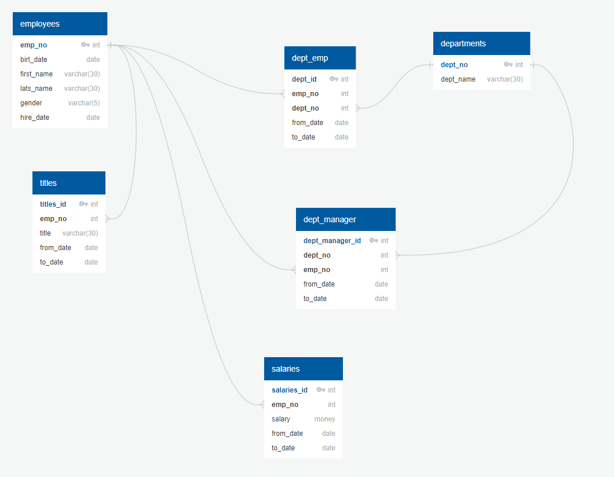
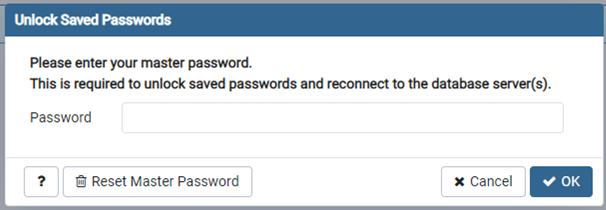

# Craete a Employee Database using PostgreSQL
* Create a local connection to PostgreSQL server and have successfully connect to it.
* Inspect the CSV's and sketch out ERD of the tables
* Design tables to hold data in CSV's
* Import CSV's into PostgreSQL
* Create a table schema for each of the CSV files

## Getting Started
PotgreSQL is an open source object-relational database management system, PostgrSQL available for MacOS, Linux, and Windows
* Remember to choose the installation package specific to your operating system and download thelatest version
* Be preapred to record the password, this will be needed later!

## Download Link(s)
* [PostgeSQL](https://www.enterprisedb.com/downloads/postgres-postgresql-downloads)
* [YouTube Instalation Guide](https://www.youtube.com/watch?v=PVJ36lHuN7Q&feature=youtu.be)

## Data Modeling
* Inspect the CSV files in data folder (above) and sketch out an ERD of the tables. I used this free tool    (http://www.quickdatabasediagrams.com)

#### My ERD Sketch

## Data Engineering
After creating our ERD we will use it to create our table Schema for each of our six CSV files with specific data types, priamry keys, foreign keys and any other constartaints we might have.

* Open pgAdmin4 and enter your password

